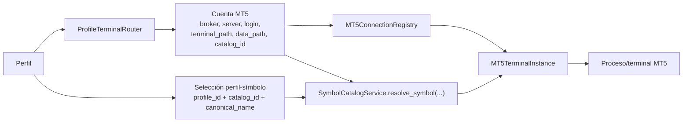

# Catálogo preestablecido Weltrade

## Arquitectura

Kraken mantiene dos responsabilidades separadas:

- `config.symbols` define los catálogos fijos visibles sin una terminal:
  `BRIDGE_SYNTHETICS` y `WELTRADE_SYNTHETICS`.
- `symbols` conserva las selecciones por perfil ya existentes. Un símbolo
  Weltrade se añade a esta tabla únicamente cuando el operador lo activa en un
  perfil.
- `symbol_catalog` persiste las 25 definiciones Weltrade mediante una migración
  explícita. No sustituye ni modifica los 40 registros Bridge existentes.

Esta separación evita insertar 25 filas por cada perfil y permite que un perfil
seleccione Bridge, Weltrade o ambos sin borrar selecciones al cambiar el filtro.

## Identidad y nombres MT5

La identidad canónica elimina espacios y usa mayúsculas. El nombre enviado a
MT5 conserva exactamente los espacios definidos por Weltrade:

- `FX Vol 20` → `FXVOL20`
- `SFX Vol 99` → `SFXVOL99`
- `GainX 1200` → `GAINX1200`
- `PainX 600` → `PAINX600`
- `FlipX 3` → `FLIPX3`

No se permiten alias o sufijos inventados. Los parsers Telegram e INTERNAL
utilizan la misma normalización canónica.

## Disponibilidad

Sin una terminal Weltrade, el catálogo muestra `NO VERIFICADO`. El servicio
`SymbolCatalogService` acepta un adaptador MT5 ya conectado y consulta
`symbol_info(mt5_symbol)` sin importar activos adicionales:

- `AVAILABLE`: el símbolo existe.
- `UNAVAILABLE`: el símbolo no existe y la ejecución debe bloquearse con un
  motivo explícito.
- `NOT_VERIFIED`: no hay terminal disponible.

Esta fase no cambia el conector MT5 ni implementa múltiples terminales.

## Compatibilidad futura multi-terminal

El catálogo no posee ni abre conexiones MT5. La resolución recibe siempre el
contexto explícito:

```python
resolve_symbol(
    canonical_symbol,
    mt5_account_id,
    catalog_id,
    profile_id,
    connection_registry=None,
)
```

La identidad del catálogo es compuesta: `catalog_id + canonical_name`. La
tabla `profile_symbol_catalog_context` conserva esa misma identidad junto con
`profile_id` y el registro de selección actual. Así, un nombre canónico podrá
existir en dos brokers sin colisión.



### Componentes preparados

- `SymbolCatalogService` es sin estado y no usa una cuenta, broker o ruta
  global.
- `ResolvedSymbol` conserva cuenta, perfil y catálogo.
- `symbol_catalog` utiliza identidad compuesta.
- `profile_symbol_catalog_context` preserva el catálogo de cada selección.
- El servicio admite un registro inyectable por `mt5_account_id`.
- `profile_mt5_accounts` ya permite vincular perfiles con cuentas concretas.

### Componentes pospuestos

- `MultiTerminalManager`: ciclo de vida coordinado de varios procesos.
- `MT5TerminalInstance`: sesión y API aisladas por terminal.
- `MT5ConnectionRegistry`: registro concurrente por cuenta.
- `ProfileTerminalRouter`: resolución definitiva perfil → cuenta → catálogo.
- Nuevos campos persistentes de cuenta como `data_path` y `catalog_id`.
- Cambios en el conector y en la ejecución real.

### Riesgos de compatibilidad

- La API Python de MetaTrader 5 mantiene estado de proceso; compartirla entre
  terminales sin aislamiento produciría cruces de cuenta.
- Un perfil mixto requerirá una regla explícita para elegir cuenta por catálogo.
- Las cuentas heredadas no tienen todavía `catalog_id`; su valor deberá
  migrarse a Bridge sin inferencias por ruta.
- La disponibilidad almacenada nunca debe considerarse global: debe tener
  cuenta, terminal y momento de verificación.
- El mismo `canonical_name` no debe consultarse sin `catalog_id`.

### Plan recomendado para la fase multi-terminal

1. Añadir mediante migración explícita `broker`, `data_path`, `catalog_id` y
   estado operativo a `mt5_accounts`, preservando `terminal_path`.
2. Implementar `MT5TerminalInstance` con ciclo de vida y bloqueo propios.
3. Crear `MT5ConnectionRegistry` indexado por `mt5_account_id`.
4. Implementar `ProfileTerminalRouter` usando `profile_mt5_accounts` y
   `catalog_id`.
5. Conectar `SymbolCatalogService` al registro e invalidar disponibilidad por
   cuenta.
6. Adaptar diagnóstico, mercado y ejecución para recibir el contexto resuelto.
7. Certificar primero dos terminales en SIMULATION y mantener DEMO/LIVE
   bloqueados hasta completar aislamiento y pruebas de recuperación.

## Migración explícita

La aplicación no importa ni ejecuta automáticamente la migración.

```python
from database.weltrade_symbol_catalog_migration import upgrade, downgrade

upgrade(connection)    # crea/puebla exactamente 25 entradas, idempotente
downgrade(connection)  # elimina solo WELTRADE_SYNTHETICS
```

La migración se valida exclusivamente con SQLite temporal. No debe ejecutarse
sobre `database/kraken.db` hasta recibir autorización operativa.
